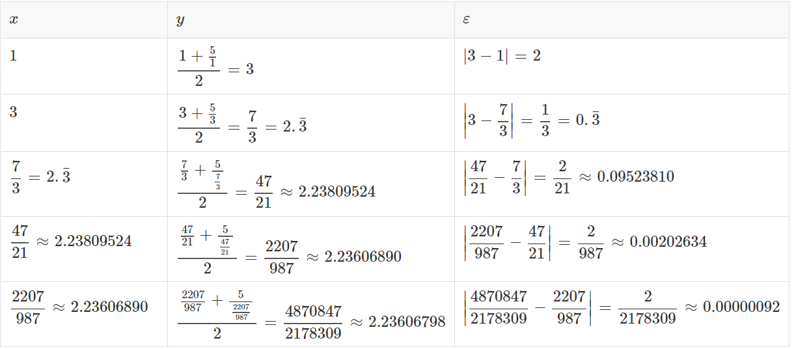

# Exercise: Approximating square roots with the Babylonian method
## Table of Contents
[Problem statement](#problem-statement) 
[Background](#background) 
[Instructions](#instructions) 
&emsp;[Docstring](#docstring) 
[What does the template do?](#what-does-the-template-do) 
[Running your code](#running-your-code) 
[Submitting your code](#submitting-your-code) 

## Problem Statement
Following the instructions below, write a function called sqrt_b() that implements the "Babylonian method" of approximating square roots of positive numbers.

## Background
The earliest algorithm for approximating a square root was first described by Greek mathematician [Hero (or Heron) of Alexandria](https://en.wikipedia.org/wiki/Hero_of_Alexandria). It is known as the [Babylonian method](https://en.wikipedia.org/wiki/Methods_of_computing_square_roots#Babylonian_method) or Heron’s method. To use it, you need to know two things:

- **S**: some positive number whose square root you want to approximate

- **p**: the desired "precision" (in other words, some positive number that indicates how close the answer has to be to the actual square root in order to be close enough for your needs; for example, 0.000000001)

Once you have those two values, here’s how to apply the Babylonian method:

1. Make up an initial guess about the square root. A number close 
   to the actual square root works best, but any positive number will do. Let’s call this x.

2. Calculate [x+(S/x)]/2 . Let’s call this y. This is almost always a 
   better approximation of $\sqrt{S}$ than x was (or at least an equally good approximation).

3. Calculate |y-x| (those vertical lines mean "absolute value"). 
   Let’s call this ε. This gives us some idea how much better an approximation y is compared to x.

4. If ε is less than p (your precision), stop here; the value of 
   y is your approximation of the square root of S.

5. Otherwise, use the value of y as the new value of x and repeat 
   from step 2.

For example, let’s say you are trying to approximate the square root of 5 to a precision of 0.000001. Let’s use 1 as the initial value of x. The following table shows how we would derive subsequent values of y, ε, and x. Once ε is less than p (in this case, 0.000001, which can also be written 1×10⁻⁶ or (in Python) 1e-6), the value of x should be close enough for our needs.

So, the square root of 5 is approximately 2.23606798 ± 0.000001.

## Instructions
Write your solution using the provided template babylonian.py. Make sure your file has this exact name. Be especially careful if you downloaded the template file more than once, as browsers often add things like (2) to the end of filenames in order not to overwrite the original file. If your browser added things to the filename, please change it back to babylonian.py. Letter case in filenames is significant on Gradescope, so make sure your filename doesn’t contain capital letters.

Find the comment in the file that says
&emsp;*#Replace this comment with your implementation of the sqrt_b() function.*

Delete that comment and write a function called sqrt_b() in its place. Your function should take one required parameter (the number whose square root the function will calculate) and one optional parameter called p (the precision of the answer). Please use 1e-10 as the default value of p.

Your function should implement the algorithm described above. It should return (not print) the approximation.

### Docstring
Your function should have a complete docstring that satisfies the guidelines in this document: https://umd.instructure.com/courses/1320803/pages/docstrings. Your function will take arguments and will return a value, so it will need an "Args:" section and a "Returns:" section. Like all docstrings, it should start with a very brief explanation of what the function does (note: this is not an explanation of how the function does what it does).

## What does the template do?
The provided template, babylonian.py, provides code that calls your function and processes command-line arguments. Basically, it contains a framework so you can type input to your program at the command line when you run the program. Your function gets called inside the if __name__ == "__main__": statement at the end of the program. We will cover if __name__ == "__main__": and command-line arguments in a few weeks, when we discuss testing.

## Running your code
To run your program within the VS Code built-in terminal, first make sure you have opened (in VS Code) the directory where your program is saved. If necessary, you can go to the VS Code File menu and select "Open…​​" on macOS or "Open Folder…​" on Windows, and navigate to the directory where your program is.

Then, open the VS Code built-in terminal. Type python3 (on macOS) or python (on Windows) followed by a space and the name of your program. Specify a number to approximate the square root of. You may optionally add a degree of precision by adding the parameters -p and some (probably very small) number. Below are some examples of ways to invoke your program:
&emsp;*python3 babylonian.py 13* 
&emsp;*python3 babylonian.py 13 -p 0.0000001* 
&emsp;*python3 babylonian.py 13 -p 1e-20*

## Submitting your code
Upload your babylonian.py script to Gradescope. An autograder script will give you near-instant feedback. If you did not pass all the test cases, you can revise your code and resubmit as many times as you want until the deadline.